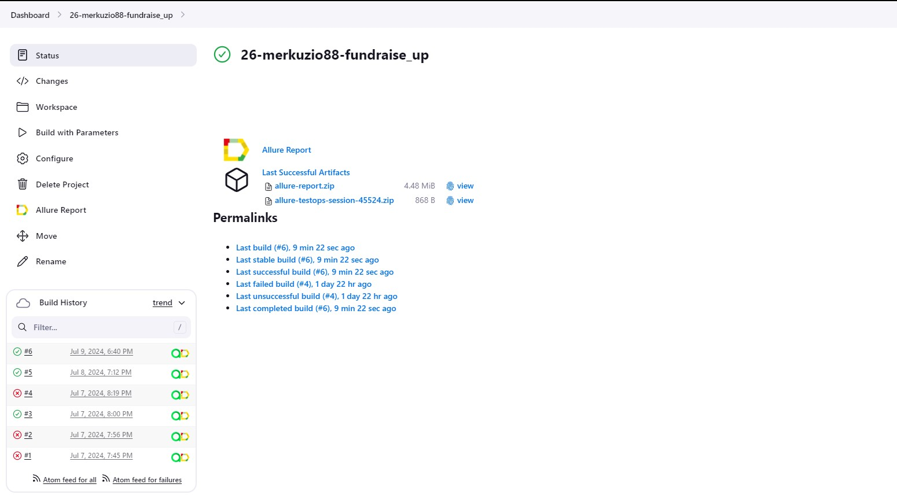
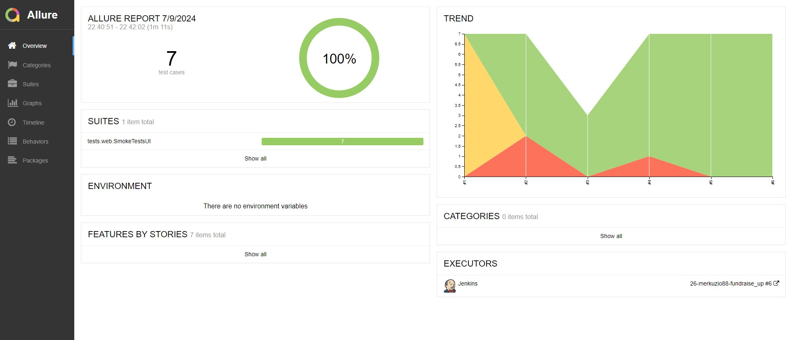
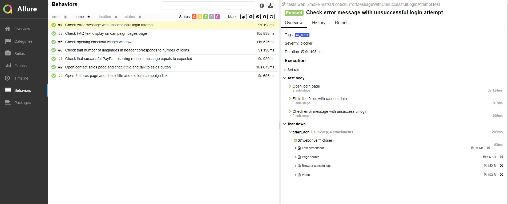
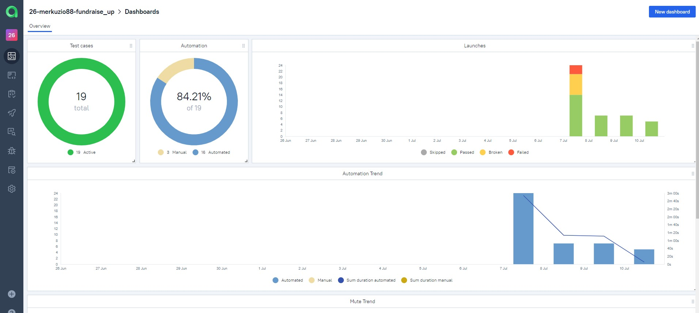
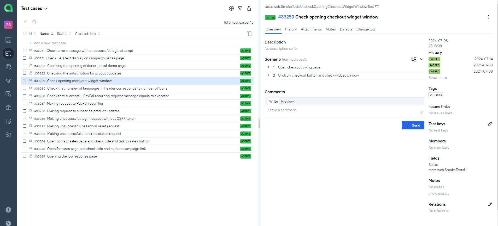
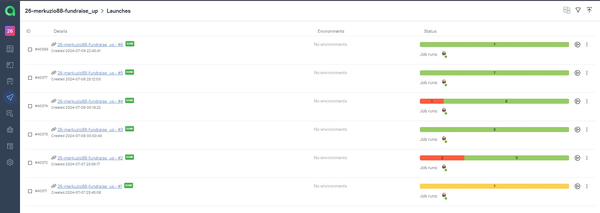
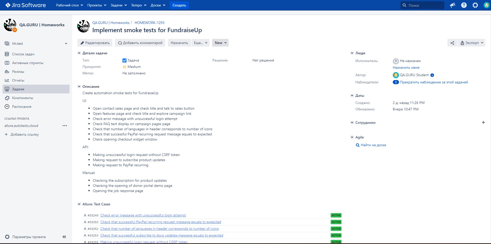
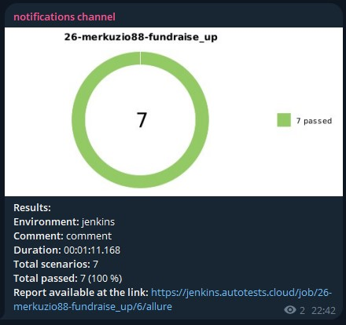
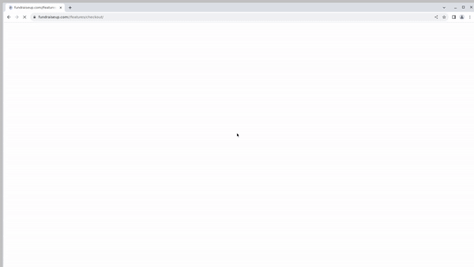

# Training project to automate test scenarios for the company's website [fundraiseup.com](https://fundraiseup.com/)

---

<a href="https://fundraiseup.com/"></a>

---

## Content:

- <a href="#tools">Tools and technologies</a>
- <a href="#scenarios">Test scenarios</a>
- <a href="#jenkins">CI/CD with Jenkins</a>
- <a href="#cli">Launch from the CLI</a>
- <a href="#allure">Allure reporting</a>
- <a href="#allure-testops">Integration with Allure TestOps</a>
- <a href="#jira">Integration with JIRA</a>
- <a href="#telegram">Bot notifications in Telegram</a>
- <a href="#video">Examples of test execution</a>


<a id="tools"></a>
## Tools and technologies:
<p align="center">
<a href="https://www.jetbrains.com/idea/"></a>  
<a href="https://www.java.com/"></a>  
<a href="https://github.com/"></a>  
<a href="https://junit.org/junit5/"></a>  
<a href="https://gradle.org/"></a>  
<a href="https://selenide.org/"></a>  
<a href="https://aerokube.com/selenoid/"></a>  
<a href="https://rest-assured.io/"></a>
<a href="https://github.com/allure-framework/allure2"></a>
<a href="https://qameta.io/"></a>   
<a href="https://www.jenkins.io/"></a>  
<a href="https://www.atlassian.com/ru/software/jira/"></a>
</p>

<a id="scenarios"></a>
## Test Scenarios
## UI
* [x] Open contact sales page and check title and talk to sales button
* [x] Open features page and check title and explore campaign link
* [x] Check error message with unsuccessful login attempt
* [x] Check FAQ text display on campaign pages page
* [x] Check that number of languages in header corresponds to number of icons
* [x] Check that successful PayPal recurring request message equals to expected
* [x] Check opening checkout widget window
## API
* [x] Making unsuccessful login request without CSRF token
* [x] Making request to subscribe product updates
* [x] Making request to PayPal recurring
## Manual
* [x] Checking the subscription for product updates
* [x] Checking the opening of donor portal demo page
* [x] Opening the job response page

<a id="jenkins"></a>
## </a><a name="CI/CD with Jenkins"></a>CI/CD with [Jenkins](https://jenkins.autotests.cloud/job/26-merkuzio88-automacon/)</a>
 

### Jenkins parameters:

- `TASK` (`ui_tests` or `api_tests`)
- `BROWSER` (browser, `chrome` by default)
- `BROWSER_VERSION` (version of browser, `122` by default)
- `BROWSER_SIZE` (browser windows size, `1920x1080` by default)
- `WD_HOST` (data of remote Selenoid server)

<a id="cli"></a>
##  Launch from the CLI

**Local launch:**
```bash  
./gradlew clean ui_tests
```

**Remote Jenkins launch:**
```bash  
clean ${TASK} -Dbrowser=${BROWSER} -DbrowserVersion=${BROWSER_VERSION} -DbrowserSize=${BROWSER_SIZE} -DwdHost=${WD_HOST}
```

<a id="allure"></a>
## </a> <a name="Allure"></a>Allure [reporting](https://jenkins.autotests.cloud/job/26-merkuzio88-automacon/allure/)</a>
 

`Allure` report includes:
- Test steps
- Screenshot of the page at the last step
- Page Source
- Browser console logs
- Video of execution for automated tests



<a id="allure-testops"></a>
## </a> Integration with <a target="_blank" href="https://allure.autotests.cloud/project/4210/dashboards">Allure TestOps</a>

All test cases and execution results are available in `Allure TestOps`. Dashboard contains test runs statistics:


Test cases:


Launches:



<a id="jira"></a>
## </a> Integration with <a target="_blank" href="https://jira.autotests.cloud/browse/HOMEWORK-1208">Jira</a>

`Jira` task has information about all created test cases, their statuses and test launches results from `Allure TestOps`:



<a id="telegram"></a>
## </a> Bot notifications in Telegram
After every build Telegram bot sends notification with `Allure` report:

 

<a id="video"></a>
## </a> Example of test execution
 
